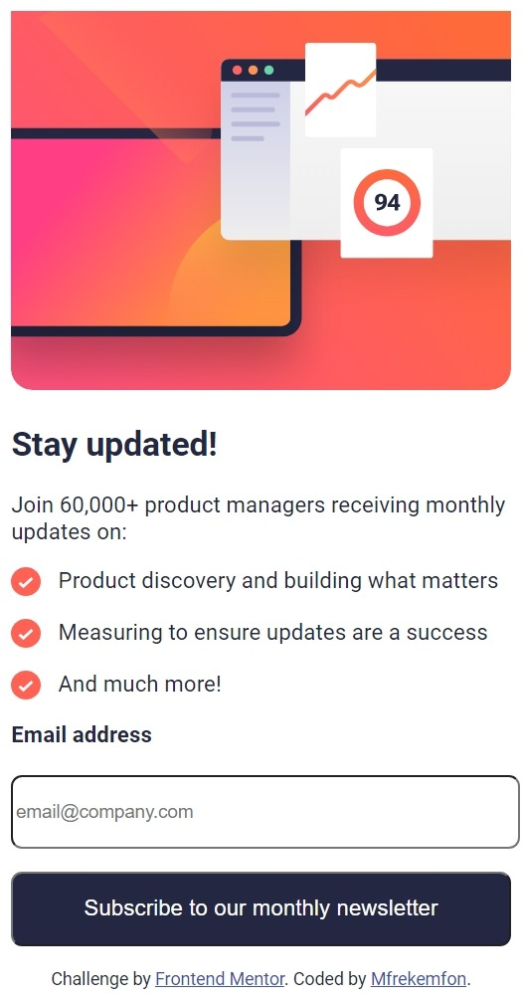
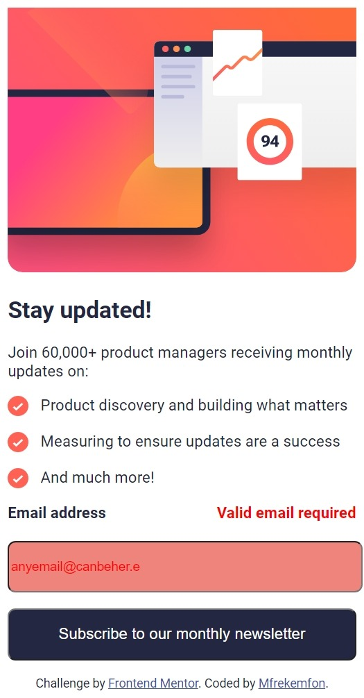
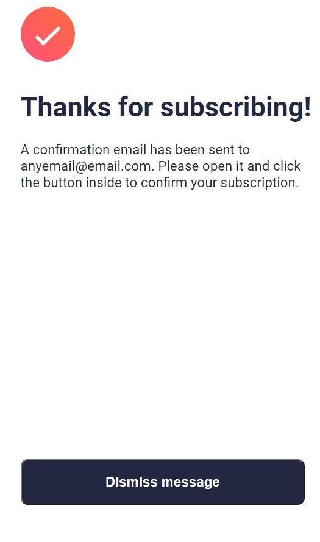
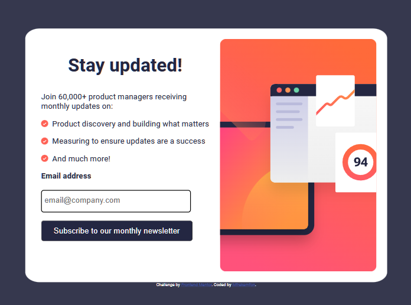
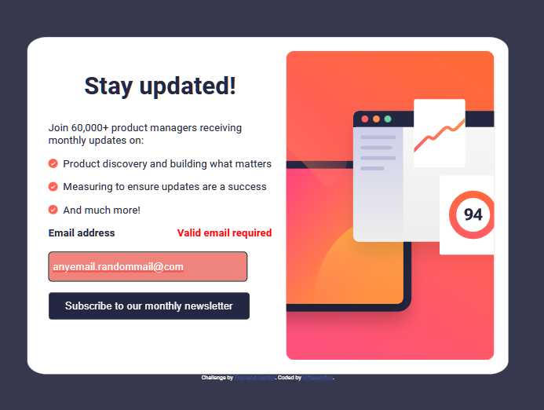
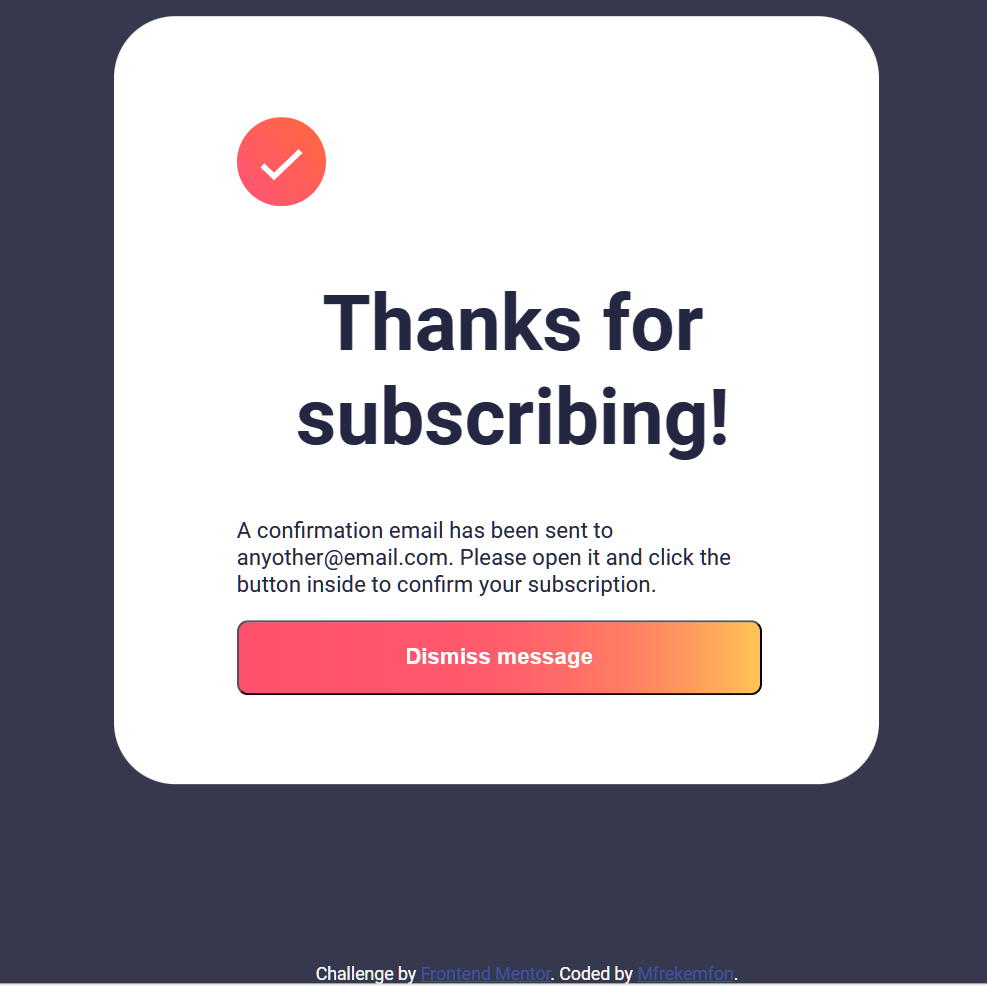
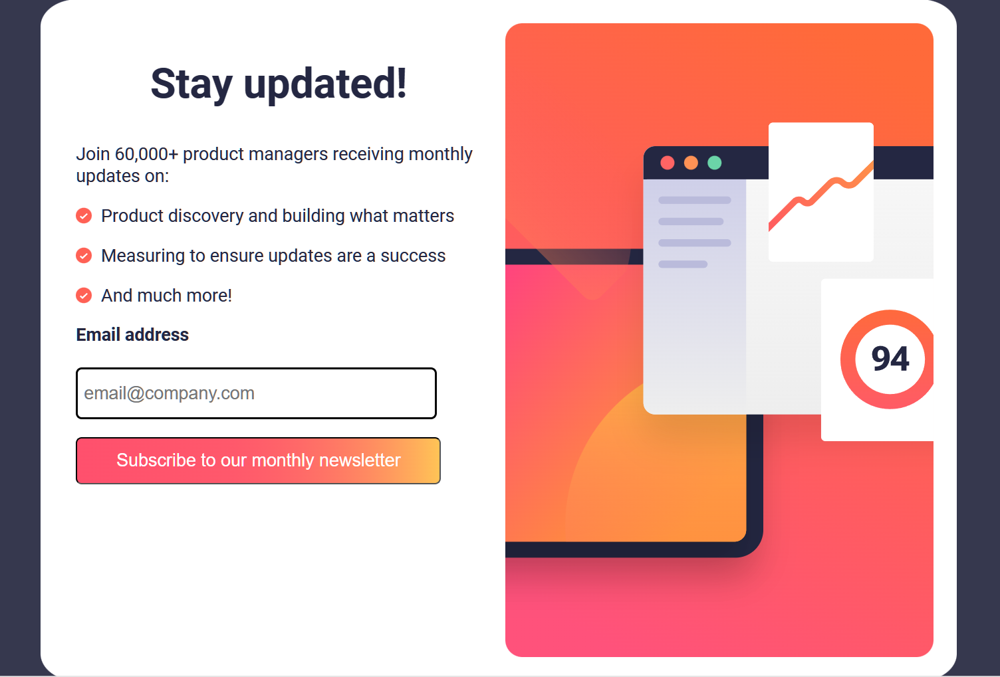

# Frontend Mentor - Newsletter sign-up form with success message solution

This is a solution to the [Newsletter sign-up form with success message challenge on Frontend Mentor](https://www.frontendmentor.io/challenges/newsletter-signup-form-with-success-message-3FC1AZbNrv). Frontend Mentor challenges help you improve your coding skills by building realistic projects. 

## Table of contents

- [Overview](#overview)
  - [The challenge](#the-challenge)
  - [Screenshots](#screenshots)
  - [Links](#links)
- [My process](#my-process)
  - [Built with](#built-with)
  - [What I learned](#what-i-learned)
  - [Continued development](#continued-development)
  - [Useful resources](#useful-resources)
- [Author](#author)
- [Acknowledgments](#acknowledgments)

**Note: Delete this note and update the table of contents based on what sections you keep.**

## Overview

### The challenge

Users should be able to:

- Add their email and submit the form
- See a success message with their email after successfully submitting the form
- See form validation messages if:
  - The field is left empty
  - The email address is not formatted correctly
- View the optimal layout for the interface depending on their device's screen size
- See hover and focus states for all interactive elements on the page

### Screenshots










These are screenshots of my solution. The images are taken at the following widths:
- Mobile: 375px
- Desktop: 1440px

### Links

- Solution URL: [Add solution URL here](https://your-solution-url.com)
- Live Site URL: [Add live site URL here](https://your-live-site-url.com)

## My process

### Built with

- Semantic HTML5 markup
- CSS custom properties
- Flexbox
- Mobile-first workflow
- Javascript
- Node.js
- Express.js(Which is built on node.js)

### What I learned

I'll use this section to recap over some of my major learnings while working through this project.

```html
<h1>Some HTML code I'm proud of:</h1>
<input required>
```
```css
.proud-of-this-css {
  .popup {
  display: none;
  position: absolute;
  background-color: white;
  left: 0;
  top: 0;
}

button:active{
    background: linear-gradient(to right, rgb(255, 80, 109),80%, rgb(255, 196, 86));
    cursor: pointer;
  }
}
```
```js
//Client-Side
const proudOfThisFunc = () => {
 button.addEventListener("click", function(event) {
  emails = emailInput.value;
  fetch('http://localhost:5500/submit-email', {  // Modify the URL here
    method: 'POST',
    headers: {
      'Content-Type': 'application/json'
    },
    body: JSON.stringify({ emails })
  })
  .then(response => {
    // Handle the server response here
    if (response.ok) {
      // The email was successfully processed on the server
      console.log('Email sent successfully');
    } else {
      // Handle errors or other non-successful responses
      console.error('Error sending email');
    }
  })
  .catch(error => {
    // Handle any network or other errors
    console.error('Network error:', error);
  });
});

const form = document.getElementById('myForm');

form.addEventListener('submit', function(event) {
  event.preventDefault();

  const error = document.querySelector("input");
  const errorText = document.querySelector(".error-message");

  function validateEmail(emails) {
    var re = /^(([^<>()\[\]\\.,;:\s@"]+(\.[^<>()\[\]\\.,;:\s@"]+)*)|(".+"))@((\[[0-9]{1,3}\.[0-9]{1,3}\.[0-9]{1,3}\.[0-9]{1,3}\])|(([a-zA-Z\-0-9]+\.)+[a-zA-Z]{2,}))$/;

    if (re.test(String(emails).toLowerCase())) {
      console.log("Email is valid", emails);
      section.style.display = "none";
      popup.style.display = "block";
      document.querySelector(".s1").innerHTML = s2 + " " + emails + s3;

      // Reset the form
      form.reset();
      error.style.backgroundColor = "hsl(0, 0%, 100%)";
      errorText.style.display = "none";
    } else {
      console.log("Email is invalid");
      errorText.style.display = "block";
      error.style.backgroundColor = "hsl(4, 77%, 71%)";
    }
  }

  if (validateEmail(emails)) {
    console.log("Email is valid", emails);
  } else {
    console.log("Email is invalid");
  }
});
}
```
```js
//Server-Side
app.use(cors());
app.use(express.json());

app.post('/submit-email', (req, res) => {
  const email = req.body.emails;

  console.log('Email:', email);

  res.sendStatus(200);
});

app.get('/submit-email', (req, res) => {
  const email = req.body.emails;
  res.send('Email submitted');
});
```


### Continued development

By 2024, I'll be learning about databases. So when I'm done with that, I would be bck to this project so that the user's email will actually be sent to a database, and not just to the server.

### Useful resources

- [HTML Color Picker](https://www.w3schools.com/colors/colors_picker.asp) - This helped me when I was trying to get color combinations for the active states.
- [The Screen interface](https://developer.mozilla.org/en-US/docs/Web/API/Screen) - I tried this when I was trying to access the screen sizes/ viewport widths(or you could say Media Queries) using Javascript. 


## Author

- Frontend Mentor - [@Mfrekee](https://www.frontendmentor.io/profile/Mfrekee)
- Twitter - [@acmfrekemfon](https://www.twitter.com/acmfrekemfon)

## Acknowledgments

- This work benefited from the assistance of [Codeium's](https://codeium.com/) AI Assistant, and [Microsoft Bing Co-pilot](https://www.microsoft.com/en-us/edge/features/bing-chat?form=MA13FJ)(developed by OpenAI) which provided guidance and support with code-related tasks.
